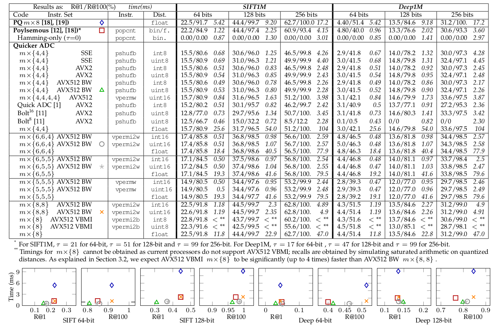
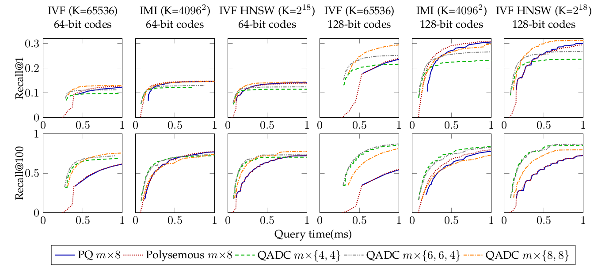

# Quicker ADC

## Description
Quicker ADC is an implementation of fast distance computation techniques for nearest neighbor search in large-scale databases of high-dimensional vectors. It is based upon [Quick ADC](https://github.com/technicolor-research/quick-adc) but provides (i) AVX512 support, (ii) new optimized product quantizers, (iii) full integration with [FAISS](https://github.com/facebookresearch/faiss) from Facebook AI Research. It is thus compatible with Inverted Multi-Indexes and HNSW-based IVFs.

Quicker ADC achieves excellent performance outperforming polysemous codes in numerous configurations. We evaluated its performance for exhaustive search in the [SIFT1M](http://corpus-texmex.irisa.fr/) dataset with both 64-bit and 128-bit codes.



We also evaluated its performance for index-based (i.e., non-exhaustive) search on the [SIFT1000M](http://corpus-texmex.irisa.fr/) dataset and [Deep1B](http://sites.skoltech.ru/compvision/noimi/) dataset. For this evaluation, we used three different type of indexes ([standard IVF](https://doi.org/10.1109/TPAMI.2010.57), [Inverted Multi-Index](https://doi.org/10.1109/TPAMI.2014.2361319), and [HNSW-based IVFs](https://arxiv.org/abs/1603.09320)). For each combination of a product quantizer implementation with an index, we plot the curve that gives the achievable recall (R@1 and R@100) given a query time budget. Quicker ADC is particularly efficient for low query times, R@100 and Deep1B dataset.

**Results for SIFT1000M on AWS m5 instances**


**Results for Deep1B on AWS m5 instances**


The algorithms implemented and complete commented results are described in
> **Quicker ADC : Unlocking the hidden potential of Product Quantization with SIMD**  
> Fabien André, Anne-Marie Kermarrec and Nicolas Le Scouarnec  
> *arXiv*  
> December 2018  
> https://arxiv.org/xxx

For more details on FAISS see the main [repository](https://github.com/facebookresearch/faiss) and the faiss's [README.md](README-faiss.md).

## License
Modifications related the introduction of Quicker ADC (Vectorized Product Quantization)
are licensed by Thomson Licensing, SAS under the Clear BSD license found in the LICENSE file in the root directory
of this source tree.

The rest of the source code is licensed by Facebook under the BSD license found in the
LICENSE file in the root directory of this source tree

## Building and Testing

### Compiling the library and a demo program
```
./configure
make
make demo/demo_ivfvpq_indexing
```

The configure script detects the architecture of the CPU and enable SIMD instruction sets accordingly. 

### Compiling the Python interface and running a program
```
make py
PYTHONPATH=. python benchs/bench_vpq_sift1m.py
```

### Installing
```
make install
make -C python install
```

More advanced compilation and installation instructions are detailled into [INSTALL.md](INSTALL.md). Note that Quicker ADC is not pushed to Conda and must be compiled from source.

## Using in your projects

Note that only L2 distance is supported in Quicker ADC's implementation. 

```cpp
#include <faiss/VPQ_Impl.h>
 ... 
 // Declare and IVF based on Quicker ADC (similar to IndexIVFPQ)
 // The suffix describes the variant desired, as specified in VPQ_Impl.h
 // In this case it is (16x{4,4} based on SSE)
 faiss::IndexIVFVPQ_2v4 index (&coarse_quantizer, d, ncentroids);

 // Declare and structure for exhaustive search based on Quicker ADC (similar to IndexPQ)
 // The suffix describes the variant desired, as specified in VPQ_Impl.h
 // In this case it is (16x{4,4} based on SSE)
 faiss::IndexIVFVPQ_2v4 index (d);

 // You can use them similarly to IndexPQ and IndexIVFPQ. Note that they do not support OnDiskInvertedList.

```

Check [VPQ_Impl.h](./VPQ_Impl.h) for a complete list of available quantizers, or if you want to add a new quantizer.

## Design
The Quicker ADC implementation is mostly contained into IndexVPQ.h, IndexIVFVPQ.h and VecProductQuantizer.h. The first contains a flat-database relying on Quicker ADC and the second is used for database with an IVF and relying on Quicker ADC. The last contains the actual Product Quantizer implementation and is referenced by the two first. The implementation relies on templates so that numerous variants share the same code that is specialized at compile time thanks to compiler knowledge template parameter values. This increase compile time but allow numerous variants to be implemented in a concise and maintanable way. To use a particular variant, it should be declared in [VPQ_Impl.h](./VPQ_Impl.h): this enables auto-tuning (index construction from CLI) and serialization specific routines. If you need to have a switch/case that depends on Index type, you should use EXPAND_VPQTEST macro; use it as depicted in this example for serialization
```cpp
template<class T_IVPQ>
bool write_indexVec(const AbstractIndexVPQ* idx, IOWriter *f){
	if(const T_IVPQ* ivpq = dynamic_cast<const T_IVPQ*>(idx)){
		std::string a = fourcc_vpq(ivpq);
		uint32_t h = fourcc(a.c_str());
		WRITE1 (h);
		write_index_header (ivpq, f);
		write_VecProductQuantizer<typename T_IVPQ::VPQ_t>(&ivpq->pq, f);
		WRITEVECTOR (ivpq->codes);
		return true;
	}else{
		return false;
	}
}
...
} else if(const AbstractIndexVPQ * ivpq =
                dynamic_cast<const AbstractIndexVPQ *> (idx)) {
#define WRITE_IVPQ(t) write_indexVec<IndexVPQ<t>>(ivpq,f)
        		bool success= EXPAND_VPQTEST(WRITE_IVPQ);
        		FAISS_THROW_IF_NOT_MSG(success,"Unsupported Serialization for Vectorized PQ Index type");
}
``` 
Alternative usage examples are given in [AutoTune.cpp](./AutoTune.cpp); in that case note that macro EXPAND_VPQTEST is inside the if test and that the action block is empty (action is performed within the if, leveraging lazy evaluation). It also shows the usage of the string-based representation of the Quantizer (e.g., *VPQ_12x6.6.4_AVX512*) declared within [VPQ_Impl.h](./VPQ_Impl.h)

Note that each variant comes in multiple form useful for evaluation and debugging:
 - non-vectorized non-quantized 
 - non-vectorized quantized but not relying on quantized lookup tables
 - non-vectorized quantized and relying on quantized lookup tables
 - vectorized using SSE
 - vectorized using AVX2
 - vectorized using AVX512
 - and all for multiple types of quantization (using either signed or unsigned arithmetic)

 For example for 16x{4,4} product quantizer, the following classes are available.
 ```cpp
// Unsigned arithmetic
VecProductQuantizer_NoVecNoQuant<16,2,4,4,0,0,uint8_t,__m128i,__m128i>
VecProductQuantizer_NoVec<16,2,4,4,0,0,uint8_t,__m128i,__m128i>
VecProductQuantizer_NoVecTable<16,2,4,4,0,0,uint8_t,__m128i,__m128i>
VecProductQuantizer_NoVecTable<16,2,4,4,0,0,uint8_t,__m128i,__m256i> // With AVX2 compatible distance table layout
VecProductQuantizer_4_SSE128_unsigned<16>
VecProductQuantizer_4_AVX512_unsigned<16>
VecProductQuantizer_4_AVX256_unsigned<16>

// Signed arithmetic
VecProductQuantizer_NoVecNoQuant<16,2,4,4,0,0,int8_t,__m128i,__m128i>
VecProductQuantizer_NoVec<16,2,4,4,0,0,int8_t,__m128i,__m128i>
VecProductQuantizer_NoVecTable<16,2,4,4,0,0,int8_t,__m128i,__m128i>
VecProductQuantizer_NoVecTable<16,2,4,4,0,0,int8_t,__m128i,__m256i> // With AVX2 compatible distance table layout
VecProductQuantizer_4_SSE128<16>
VecProductQuantizer_4_AVX512<16>
VecProductQuantizer_4_AVX256<16>
```

Check [VPQ_Impl.h](./VPQ_Impl.h) for a complete list of available quantizers (mx{6,6,4}, mx{6,5,5}, mx{5,5,5}, mx{8,8}, mx{8}), or if you want to add a new quantizer.

## References
If you use or compare to this work, please cite

> **Quicker ADC : Unlocking the hidden potential of Product Quantization with SIMD**  
> Fabien André, Anne-Marie Kermarrec and Nicolas Le Scouarnec  
> *arXiv*  
> December 2018  
> https://arxiv.org/xxx
 
> **Accelerated Nearest Neighbor Search with Quick ADC**  
> Fabien André, Anne-Marie Kermarrec and Nicolas Le Scouarnec  
> *ICMR '17 Proceedings of the 2017 ACM on International Conference on Multimedia Retrieval*
> June 2017  
> https://doi.org/10.1145/3078971.3078992